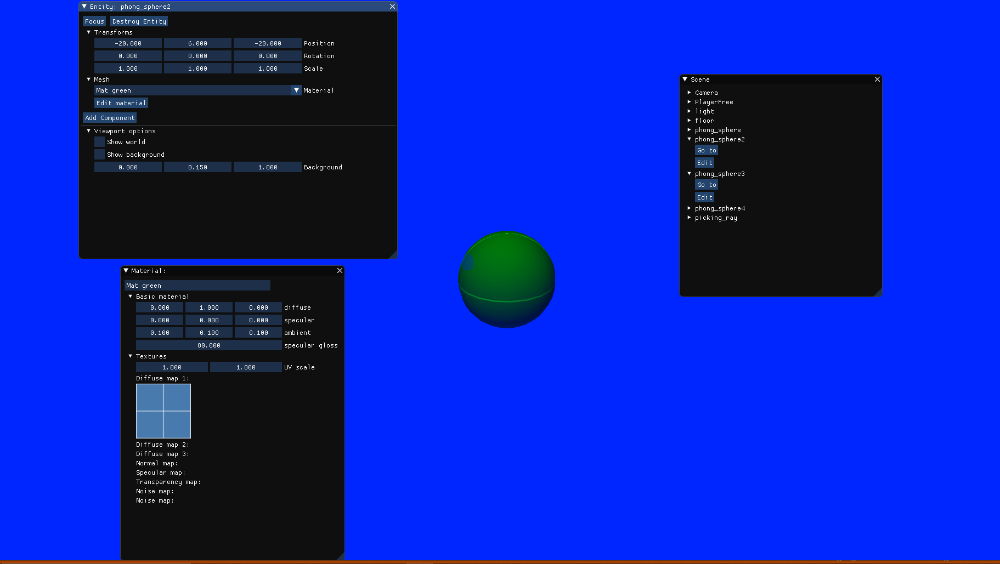
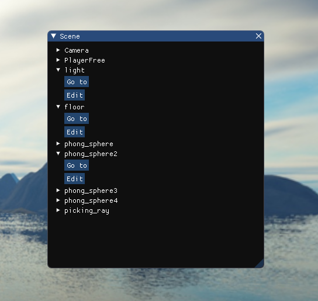
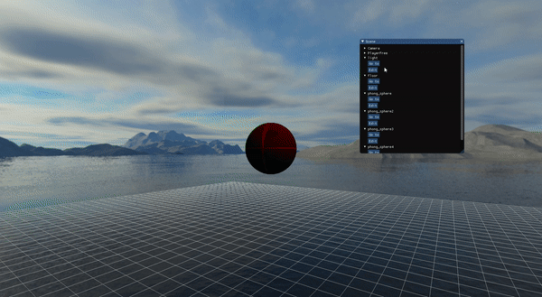
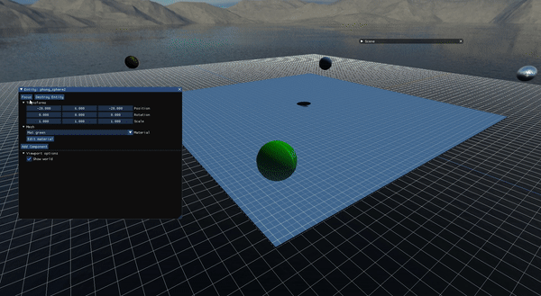
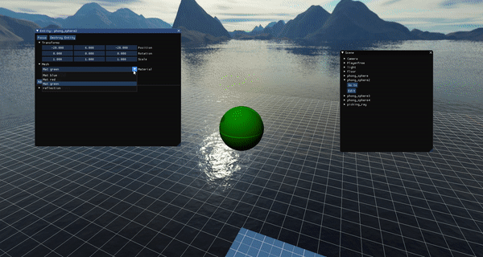
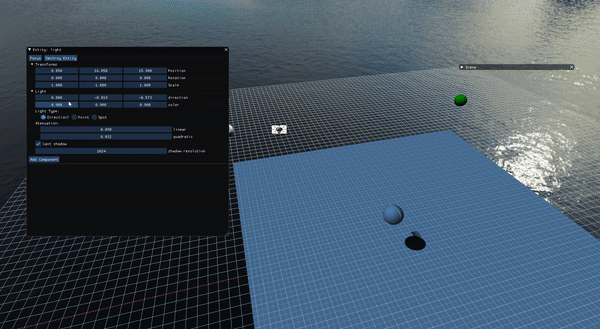

# MVD Final

We have done some utilities to improve the user debug and edition.

#### Entity targeting

We have added a button that moves the camera to the selected entity. Very useful for traveling around the scene and to find your entity.

#### Background options

To make the visualization of the entity easier we have added 3 modes;
* All the scene
* Only the background
* Custom background color

#### Material options

We have added the possibility of editing lots of the parameters in a material. 
Also, you can change the mesh material between all existent materials.

#### Light options

Now it has support for editing light attributes

